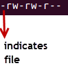

## Exercise on Linux

### 1. Users and Group Permissions

- A user is the owner of the file. By default, the person who created a file becomes its owner. Hence, a user is also sometimes called an owner.
- Group: A user- group can contain multiple users. All users belonging to a group will have the same Linux group permissions access to the file.
- Other: Any other user who has access to a file. This person has neither created the file, nor he belongs to a usergroup who could own the file.

#### Three Permissions in Linux

- Read: This permission give you the authority to open and read a file. Read permission on a directory gives you the ability to lists its content.
- Write: The write permission gives you the authority to modify the contents of a file. The write permission on a directory gives you the authority to add, remove and rename files stored in the directory.
- Execute: In Windows, an executable program usually has an extension “.exe” and which you can easily run. In Unix/Linux, you cannot run a program unless the execute permission is set.

 

 

 
.png>)

Absolute(Numeric) Mode

| Number | Permission Type       | Symbol |
| ------ | --------------------- | ------ |
| 0      | No Permission         | -      |
| 1      | Execute               | -X     |
| 2      | Write                 | -W-    |
| 3      | Execute + Write       | -WX    |
| 4      | Read                  | r-     |
| 5      | Read + Execute        | r-x    |
| 6      | Read +Write           | rw-    |
| 7      | Read + Write +Execute | rwx    |

|

### 2. Create (3) groups and (15) users

#### Create (3) Groups

- To create a group, we can run this command `groupadd <group name>`

* List all groups
  - To verify that the group has been created, we can run `cat /etc/group | grep "vit" `
    

#### Create (15) Users

- To create a single user in linux, we can use `adduser <name>` and create a password for the user using `passwd <username>` or we can run this command `useradd <name>`.

- To create multiple users, we can run `newusers <file>` where file will contain the names of the users and their passwords which are required.

steps:
i. create a new file ` touch users.txt`
ii. Run `sudo newusers users.txt` to create 15 users at once.
iii. To verify that the users have been created, by running `sudo cat /etc/passwd | grep "testuser"`.

### 3. Assign the 15 users across the 3 groups

- We can run this command `usermod -G groupname <username>` to add a user to a group.
- using the command below to add 5 users <1-5> to group vit-deploy, 5 users <6 -10> to group vit-managers and 5 users <11 -15> to group vit-dba.
  `for i in testuser1 testuser2 testuser3 testuser4 testuser5; do usermod -G vit-deploy $i; done`
  `for i in testuser6 testuser7 testuser8 testuser9 testuser10; do usermod -G vit-managers $i; done`
  `for i in testuser11 testuser12 testuser13 testuser14 testuser15; do usermod -G vit-dba $i; done`

* The members of the group will appear after the group name .
  

### 4. Demonstrate that user(s) in a group cannot access files/folders that belong to another group unless they are added to that group.

steps:

- I switch to user "testuser1" `su - testuser1`

* Create a file with text "try me" `nano testme.txt`
* Change the file permission `chmod 740` `rw- r-- ---`

- Switch to a different user in another group `su - testuser7`

* Try to read from the file
   
  

I add testuser7 to vit-deploy using the command below
`sudo usermod -aG testuser7 vit-deploy`

