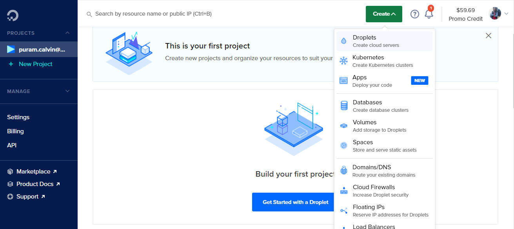
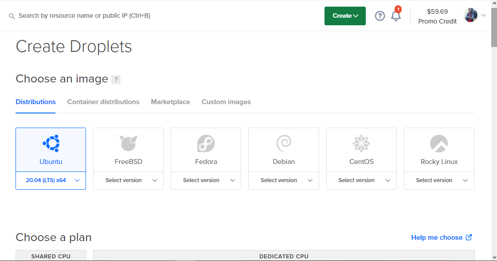
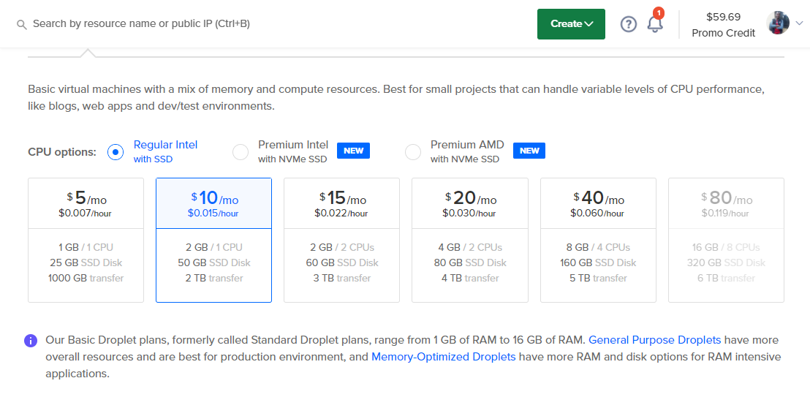
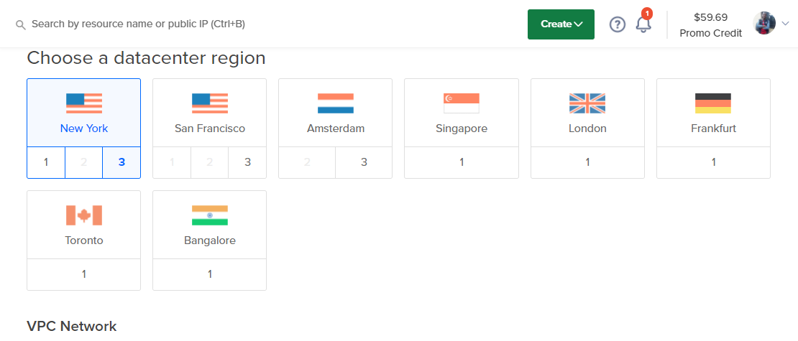
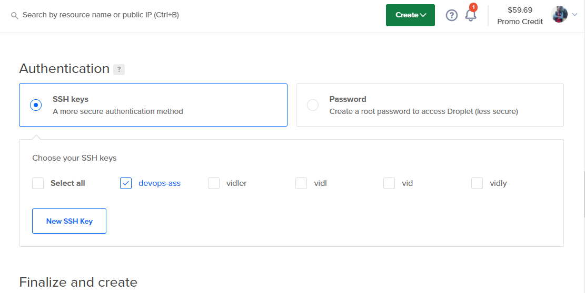
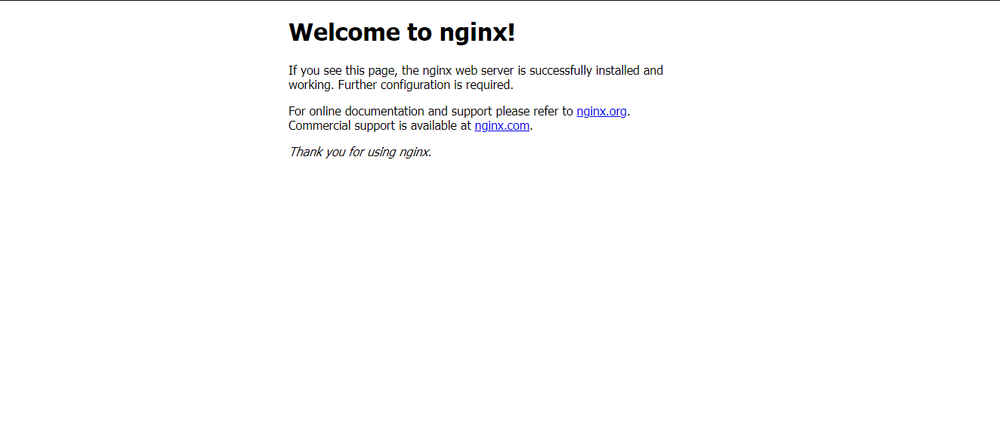
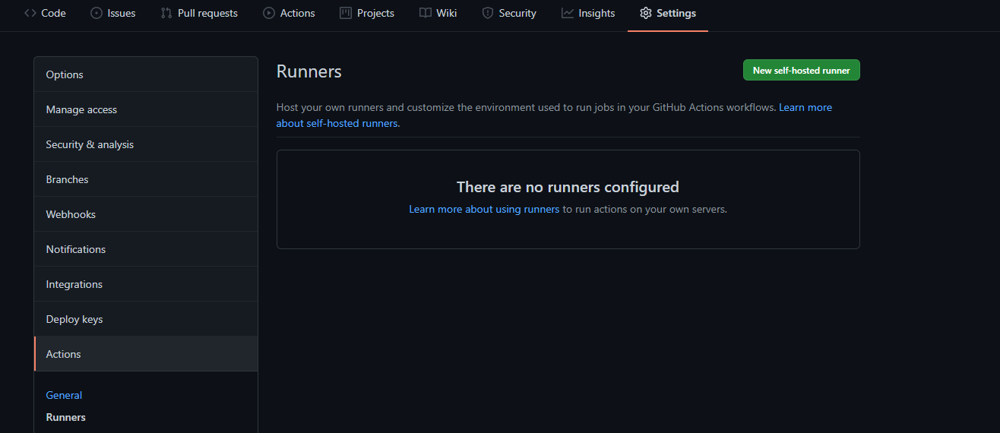
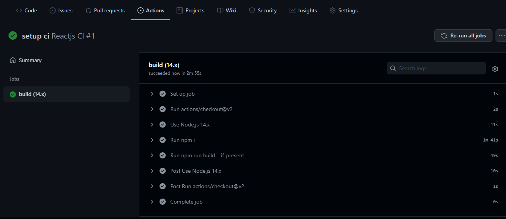
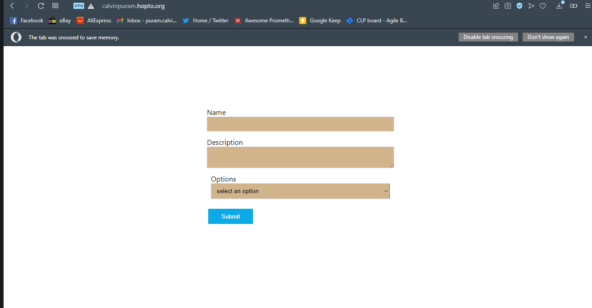

# Networking and Web Servers

## 1. What is the OSI model?

The open systems interconnection(OSI) is essentially a reference system that lays out how computers communicate with each other over a network.. The OSI Model is a universal language for computer networking. It Helps developers to design programs and products with some standard by following OSI Model and to troubleshoot a technical problem in logical steps, to see the exact problem by starting from the physical layer and moving upto the top at Application Layer. It’s based on the concept of splitting up a communication system into seven abstract layers, each one stacked upon the last.

## 2. Explain the different layers of the OSI model.

- Application Layer: This top-of-stack host layer is familiar to end users because it's home to Application Programming Interfaces (API) that allow resource sharing, remote file access, and more. It's where you'll find web browsers and apps like email clients and social media sites.

* Presentation Layer: This host layer is where data is translated and formatted so applications, networks, and devices can understand what they're receiving. Characters are encoded and data compressed, encrypted, and decrypted.

* Session Layer: Layer 5 is a host layer that acts like a moderator in that it controls the dialogue between computers, devices, or servers. It sets up pathways, limits for response wait time, and terminates sessions.

* Transport Layer: Layer 4 is a host layer that generally functions as a digital post office coordinating data transfers between systems and hosts, including how much data to send, the rate of data transmission, data destinations, and more. Although they're not included in the OSI model, Transmission Control Protocols (TCP) and User Datagram Protocols (USD) are usually categorized as Layer 4 protocols. Layer 4 is also where you'll find gateways and additional firewalls.

* Network Layer: Another media layer, Layer 3 is home to IP addresses and routers that look for the most efficient communication pathways for packets containing control information and user data, also known as a payload. If a packet is too large to be transmitted, it can be split into several fragments which are shipped out and then reassembled on the receiving end. Layer 3 also contains network firewalls and 3-layer switches.

* Data-Link Layer: This digital stratum is all about media, acting as an avenue for node-to-node data transfers of frames—simple containers for single network packets—between two physically connected devices. It's where you'll find most of the switches used to start or end communication between connected devices. Layer 2 is comprised of two sublayers: MAC, or Media Access Control, and LLC, or Logical Link Control. MAC determines how devices in a network gain access to a medium and permission to transmit data. LLC identifies and encapsulates network layer protocols and controls error checking and frame synchronization.

* Physical Layer: The Physical layer is the lowest OSI model layer which is the physical and electrical representation of the system. It is comprised of various network components such as power plugs, wireless radio frequencies, connectors, receivers, cable types, adapters, the layout of pins, and electric voltages. The main role of the physical layer is to electrically or optically transmit unstructured data bits from the physical layer’s source or sending device to the physical layer of the receiving device across the network. When there is an issue in a network, most troubleshooting will begin at its physical layer.

## 3. What do you mean by the TCP/IP Model?

The main purpose of this model is to connect two remote machines for the exchange of information. These machines can be operating in different networks or have different architecture. TCP/IP means Transmission Control Protocol and Internet Protocol. It is the network model used in the current Internet architecture as well. Protocols are set of rules which govern every possible communication over a network. These protocols describe the movement of data between the source and destination or the internet. These protocols offer simple naming and addressing schemes.

### Description of different TCP/IP protocols

Layer 1: Host-to-network Layer

i. Lowest layer of the all.

ii. Protocol is used to connect to the host, so that the packets can be sent over it.

iii. Varies from host to host and network to network.

Layer 2: Internet Layer

i. Selection of a packet switching network which is based on a connectionless internetwork layer is called a internet layer.

ii. It is the layer which holds the whole architecture together.

iii. It helps the packet to travel independently to the destination.

iv. Order in which packets are received is different from the way they are sent.

v. IP (Internet Protocol) is used in this layer.

Layer 3: Transport Layer

i. It decides if data transmission should be on parallel path or single path.

ii. Functions such as multiplexing, segmenting or splitting on the data is done by transport layer.

iii. The applications can read and write to the transport layer.

iv. Transport layer adds header information to the data.

Layer 4: Application Layer

i. The TCP/IP specifications described a lot of applications that were at the top of the protocol stack. Some of them were TELNET, FTP, SMTP, DNS etc.

ii. TELNET is a two-way communication protocol which allows connecting to a remote machine and run applications on it.

iii. FTP(File Transfer Protocol) is a protocol, that allows File transfer amongst computer users connected over a network. It is reliable, simple and efficient.

iv. SMTP(Simple Mail Transport Protocol) is a protocol, which is used to transport electronic mail between a source and destination, directed via a route.

v. DNS(Domain Name Server) resolves an IP address into a textual address for Hosts connected over a network

Merits of TCP/IP model

It operated independently.
It is scalable.
Client/server architecture.
Supports a number of routing protocols.
Can be used to establish a connection between two computers.
Demerits of TCP/IP

In this, the transport layer does not guarantee delivery of packets.
The model cannot be used in any other application.
Replacing protocol is not easy.
It has not clearly separated its services, interfaces and protocols.

## 4. What do you mean by HTTP, TCP and UDP

- HTTP (Hypertext Transfer Protocol) is the set of rules for transferring files -- such as text, images, sound, video and other multimedia files -- over the web. As soon as a user opens their web browser, they are indirectly using HTTP. HTTP is an application protocol that runs on top of the TCP/IP suite of protocols, which forms the foundation of the internet.

* TCP Stands for "Transmission Control Protocol." TCP is a fundamental protocol within the Internet protocol suite — a collection of standards that allow systems to communicate over the Internet. It is categorized as a "transport layer" protocol since it creates and maintains connections between hosts. TCP compliments the Internet protocol (IP), which defines IP addresses used to identify systems on the Internet. The Internet protocol provides instructions for transferring data while the transmission control protocol creates the connection and manages the delivery of packets from one system to another. The two protocols are commonly grouped together and referred to as TCP/IP.

* UDP Stands for "User Datagram Protocol." It is part of the TCP/IP suite of protocols used for data transferring. UDP is a known as a "stateless" protocol, meaning it doesn't acknowledge that the packets being sent have been received. For this reason, the UDP protocol is typically used for streaming media. While you might see skips in video or hear some fuzz in audio clips, UDP transmission prevents the playback from stopping completely.

## 5. What is a Firewall?

A firewall is a digital security system that checks all incoming and outgoing traffic in a network. It keeps out all unauthorized traffic and lets in only those communications that are deemed safe. Firewalls ensure a safe connection when connecting to the internet.

## 6. Explain DNS

The Domain Name System (DNS) Server is a server that is specifically used for matching website hostnames (like example.com)to their corresponding Internet Protocol or IP addresses. The DNS server contains a database of public IP addresses and their corresponding domain names. Every device connected to the internet has a unique IP address that helps to identify it, according to the IPv4 or IPV6 protocols. DNS servers help us avoid memorization of such long numbers in IP addresses (and even more complex alphanumeric ones in the IPV6 system) as they automatically translate the website names we enter into the browser address bar into these numbers so that the servers can load the right web pages.

## 7. Deploy a fullstack application to DigitalOcean using Github Actions

<br>
For the purpose of this task I will setup a react application using "create-react-app" and a single Nodejs application and automate the deployment of this application to DigitalOcean using Github action.

Step 1: Provision a remote server.

- Create a DigitalOcean Droplet
  
- Choose an Image:
  To launch a VPS, I’ll choose the Ubuntu Linux distribution as the operating system because of its low learning curve, efficiency, and popularity.

  

* Choose a plan:
  I’ll create a standard $10/mo droplet with 2GB of RAM, 1 CPU core, and 50GB of disk space.
  
* Choose a datacenter region
  I’ll use New York 1 since it’s the closest to me.
  

* Authentication
  I’ll select ssh option and create a new server
  

* Connecting to a remote server

```
ssh root@ip -i ~/.ssh/devops-ass

```

- Creating a deployment user

```
adduser deploy
```

- Granting sudo access to our user

```
usermod -aG sudo deploy
```

- Adding SSH key for deploy user
  We need to be able to login directly as the deploy user via SSH key authentication. At the moment,
  the authorized_keys file we added our key is only available to the root user. To use this SSH key to
  login as the deploy user, we need to make this key available to the deploy user too.

  ```
  mkdir /home/deploy/.ssh
  cp /root/.ssh/authorized_keys /home/deploy/.ssh/authorized_keys
  chown -R deploy:deploy /home/deploy
  ```

- Set up firewall

```
sudo ufw allow 22 # port for ssh
sudo ufw allow 'Nginx Full' # port for http and https
sudo ufw enable # enable firewall
```

- To install nginx, I’ll run the following command
  Nginx is an open-source web server software. When web traffic comes into our server, we can
  configure Nginx to handle this traffic appropriately. That can involve a lot of different tasks, such as
  serving our actual website, caching the results of the request to enable much faster responses in
  future, and load balancing

```
sudo apt-get install -y nginx
```

Now we can run `nginx -v` to confirm its installation.

We can check the status of the Nginx service using `sudo service nginx status`. You should see Nginx
running



- Removing the default site.

```
sudo rm /etc/nginx/sites-enabled/default
sudo rm /etc/nginx/sites-available/default
sudo rm -rf /var/www/html
```

- Setting up Github Action Runner

```
npx create-react-app #to create a new react application
```

push the newly created file to github

create `.github/workflows ` folder and define github actions jobs

```


name: Reactjs CI

on:
  push:
    branches: [ master ]
  pull_request:
    branches: [ master ]

jobs:
  build:

    runs-on: self-hosted

    strategy:
      matrix:
        node-version: [14.x]


    steps:
    - uses: actions/checkout@v2
    - name: Use Node.js ${{ matrix.node-version }}
      uses: actions/setup-node@v2
      with:
        node-version: ${{ matrix.node-version }}
        cache: 'npm'
    - run: npm i
    - run: npm run build --if-present


```

Next is to setup Github Action runner on DigitalOcean
step1: navigate to project settings on github and locate `actions` and click on "runners"

step2: click on new self hosted runner and select linux as our operating system
step3: follow the instruction below

```
# Create a folder
$ mkdir actions-runner && cd actions-runner# Download the latest runner package
$ curl -o actions-runner-linux-x64-2.284.0.tar.gz -L https://github.com/actions/runner/releases/download/v2.284.0/actions-runner-linux-x64-2.284.0.tar.gz# Optional: Validate the hash
$ echo "1ddfd7bbd3f2b8f5684a7d88d6ecb6de3cb2281a2a359543a018cc6e177067fc  actions-runner-linux-x64-2.284.0.tar.gz" | shasum -a 256 -c# Extract the installer
$ tar xzf ./actions-runner-linux-x64-2.284.0.tar.gz
```

and run the following to configure the runner

```
# Create the runner and start the configuration experience
$ ./config.sh --url https://github.com/calvin-puram/form-component --token AOMAJNFMSS5JHS5TTYRZWO3BUIKA6# Last step, run it!
$ ./run.sh
```

confirm that our build is passing


- Configuring Nginx to serve our react app

```
server {
  listen 80;
  root /home/deploy/actions-runner/_work/form-component/form-component/build;
  server_name calvinpuram.hopto.org;
  location / {
  try_files $uri $uri/ =404;
  }
}
```

i. The root of our project point to the folder in which we have our build. In this case, it’s
/home/deploy/actions-runner/\_work/form-component/form-component/build.
ii. The server_name match the domain of our site.

iii. Running the following command to open a new configuration file

```
sudo nano /etc/nginx/sites-available/calvinpuram.com

```

- create a symlink of the configuration file in the sites-enabled

```
sudo ln -s /etc/nginx/sites-available/calvinpuram.com /etc/nginx/sites-enabled/
```

then reload nginx

```
sudo service nginx reload
```



- Obtain an SSL certificate using Let’s Encrypt

```
sudo apt-get install -y certbot python-certbot-nginx

```

- obtaining the certificate

```
sudo certbot certonly --nginx -d calvinpuram.com
```

- The certonly option tells certbot not to install the certificate once issued.
- The --nginx flag indicates to Certbot that I configured the web server using Nginx, and it’ll
  use the python-certbot-nginx package I installed.
- The -d command defines the domain

* The above command generates a folder /etc/letsencrypt/live/calvinpuram.com and
  places some files in it:

  - privkey.pem : The private key for your certificate. Used to decrypt data signed using the public
    key (certificate) from the user’s browser.
  - fullchain.pem: It refers to the certificate file sent to clients

* Automating certificate renewals
  When Certbot issue certificates, it automatically creates a cron job to
  renew certificates.

  ```
  sudo certbot renew --dry-run
  ```

* Securing nginx
  The next step is configuring Nginx to serve the site using this certificate. I modify the Nginx configuration to
  serve this certificate.

  ```
  sudo nano /etc/nginx/sites-available/calvinpuram.com
  sudo service nginx reload
  ```
