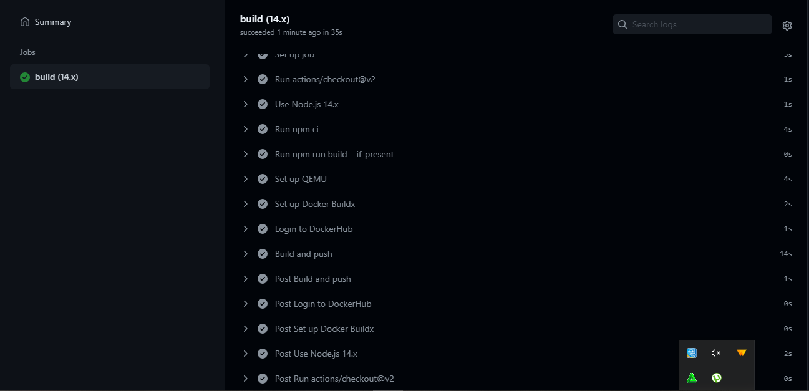
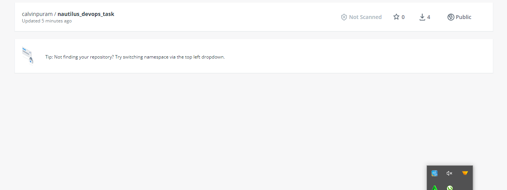
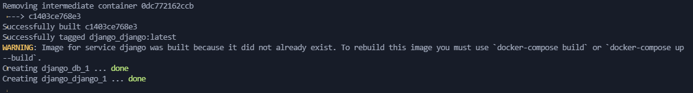
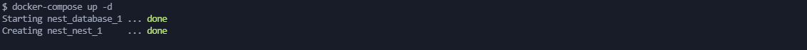
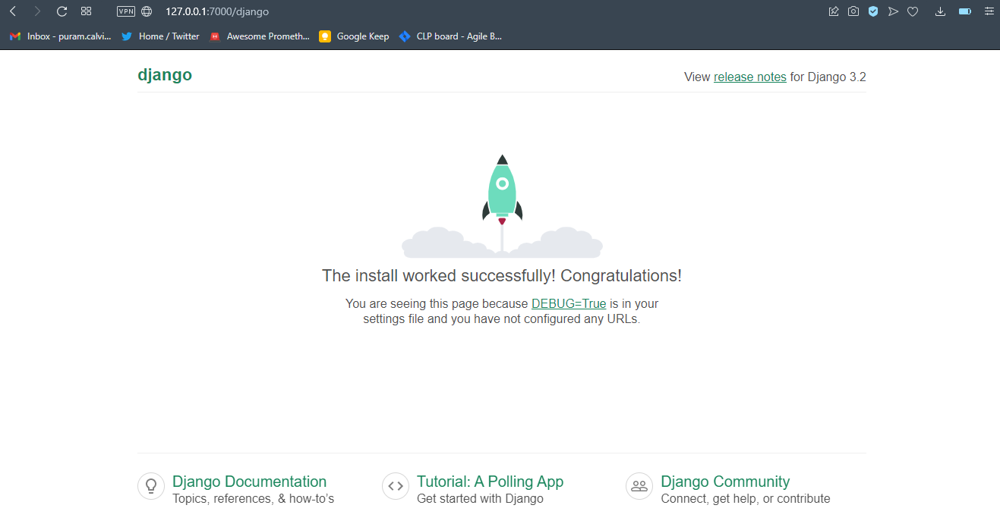
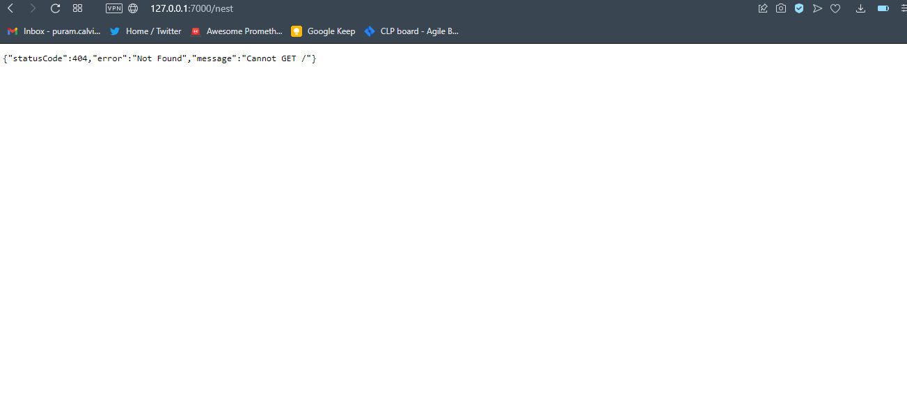

# Containerization with Docker

## Task 1:

Containerizing an open source Nodejs application using docker and pushing the image to docker hub using the following tools:

- Docker - to build the image,
- Nginx - to route traffic to the application,
- Github Actions - to automate building the image and pushing to docker hub

### Steps:

1. Fork an open source nodejs project from https://github.com/bradtraversy/devcamper-api
2. Clone the project to my local environment
3. The Nodejs application is built with a mongoDB database so create a docker file with the following configuration

```
// Dockerfile

FROM node:12-alpine3.14
WORKDIR /app
COPY package*.json ./
ARG NODE_ENV
RUN if [ "$NODE_ENV" = "development" ]; \
        then npm install; \
        else npm install --only=production; \
        fi
COPY . .
EXPOSE 5000
CMD ["npm", "run", "start"]

```

4. Create a docker compose file for development (a structure has been extablished to install development dependencies when in development and ignore when in production).

Docker Compose is used to deploy multiple containers. The mongodb database and the nodejs application will be in two isolated containers.

- Run `touch docker-compose.yaml ` to create the Docker Compose file for development.

```
// dockercompose in development
version: "3.8"
services:
  nginx:
    image: nginx:mainline-alpine
    ports:
      - "5000:80"
    volumes:
      - ./nginx/default.conf:/etc/nginx/conf.d/default.conf
    depends_on:
      - backend
  backend:
    build:
      context: .
      args:
        NODE_ENV: development
    volumes:
      - .:/app
      - /app/node_modules
    depends_on:
      - db
    env_file:
      - ./.env

  db:
    image: mongo:4.4.8
    ports:
      - "27017:27017"
    volumes:
      - vidly:/data/db

volumes:
  vidly:

```

5. Create a production docker compose file

- Run `touch docker-compose-prod.yaml ` to create the Docker Compose file for development.

```
# docker compose in production

version: "3.8"
services:
  build:
    context: .
    depends_on:
      - db
    env_file:
      - ./.env
    restart: unless-stopped
    command: npm run start

  nginx:
    image: nginx:mainline-alpine
    ports:
      - "80:80"
    volumes:
      - ./nginx/default.conf:/etc/nginx/conf.d/default.conf:ro

  db:
    image: mongo:4.4.8
    ports:
      - "27017:27017"
    volumes:
      - vidly:/data/db
    restart: unless-stopped

volumes:
  vidly:

```

6. Created a dockerignore file to ignore some unnecessary files

```
# dockerignore file

node_modules/
.DS_Store
config/config.env
.env
```

7. Setup Nginx to route traffic from port 80 to 5000 and test the configuration

```
server {
  listen 80;

  location / {
  proxy_pass http://backend:5000;
  proxy_set_header X-Forwarded-For $proxy_add_x_forwarded_for;
  proxy_set_header X-Real-IP $remote_addr;
  proxy_set_header Host $http_host;
  proxy_http_version 1.1;
  }
}
```

- The docker compose file for both development and production contains three services; **_backend_** representing the NodeJS application **_Nginx_** as an open source web server and **_db_** for the database.

- We can start the services using this command ` docker-compose up -d -f docker-compose-prod.yml` which will pull the images and start a process. The -d starts the service in the background and -f specifies the file.

- We can build the image using this command ` docker build -t calvinpuram/devops_task:1.0.0 .` the `.` specify the current directory and -t specify the image tag.

8. Upload Nodejs application to Docker HUb.

- You need to sign up at https://hub.docker.com and create a repository.

- You can tag the repo using this command ` docker tag <new-image> <docker_username/<repo_name>`

- Push to Docker hub using the command `docker push <docker_username>/<repo_name>`

- If you make changes to your code you will need to create a new tag, build the image and push to docker hub. For this reason You can use github actions to automate building and deploying new changes to docker hub

9. Set up Github Actions workflow to auto build and deploy the image to dockerhub.

GitHub Actions is a continuous integration and continuous delivery (CI/CD) platform that allows you to automate your build, test, and deployment pipeline.

create a `.github/workflows/ci.yaml` file

```
name: Node.js CI

on:
  push:
    branches: [master]
  pull_request:
    branches: [master]

jobs:
  build:
    runs-on: ubuntu-latest

    strategy:
      matrix:
        node-version: [12.x, 14.x, 16.x]

    steps:
      - uses: actions/checkout@v2
      - name: Use Node.js ${{ matrix.node-version }}
        uses: actions/setup-node@v2
        with:
          node-version: ${{ matrix.node-version }}
          cache: "npm"
      - run: npm ci
      - run: npm run build --if-present

      - name: Set up QEMU
        uses: docker/setup-qemu-action@v1
      - name: Set up Docker Buildx
        uses: docker/setup-buildx-action@v1

      - name: Login to DockerHub
        uses: docker/login-action@v1
        with:
          username: ${{ secrets.DOCKERHUB_USERNAME }}
          password: ${{ secrets.DOCKERHUB_TOKEN }}

      - name: Build and push
        id: docker_build
        uses: docker/build-push-action@v2
        with:
          push: true
          tags: calvinpuram/nautilus_devops_task:1.0.0

```





- Link to Docker Repository - https://hub.docker.com/repository/docker/calvinpuram/nautilus_devops_task
- Link to Project Repository - https://github.com/calvin-puram/devcamper-api

## Task 2:

Using Docker-Compose, configure and deploy an nginx application that routes to two applications running also in docker.

Specifications: Using nginx location directive, /django -> should route to app1 /nest -> should route to app2

### Steps:

App1 and App2 consists of a Django app and a NestJS app running on ports 8000 and 5000 respectively.

- Create a folder and clone the two repo into that folder. Reverse proxying with nginx with route traffic to the two apps
- In the root directory create a folder called `nginx` and a file in the folder call `nginx.conf` this file will have our nginx configuration

- Copy and paste the nginx configuration below into `nginx/nginx.conf`

```
server {
  listen 80;
  server_name localhost;

  location /django {
    proxy_pass http://django:8000/;
    proxy_set_header Host $host;
    proxy_set_header X-Real-IP $remote_addr;
    proxy_set_header X-Forwarded-For $proxy_add_x_forwarded_for;
  }

  location /nest {
    proxy_pass http://nest:5000/;
    proxy_set_header Host $host;
    proxy_set_header X-Real-IP $remote_addr;
    proxy_set_header X-Forwarded-For $proxy_add_x_forwarded_for;
  }
}
```

i. proxy_pass - This is an essential directive. A server block defines the configuration
for a site. We are instructing Nginx, in this case, to direct all incoming traffic for the
http://127.0.0.1/django to the django server running on http://django:8000/ and http://127.0.0.1/nest to the nodejs server running on http://nest:5000/. When the Nodejs or python server generates a response, Nginx receives the response and sends that response back to the client or browser that made the request.

- Create a docker-compose.yml file in the root directory. Copy and paste the contents below.

```
services:
  nginx:
    restart: unless-stopped
    build: ./nginx/
    ports:
      - '7000:80'

```

i. with this setup we can access nginx from our browser using `http://127.0.0.1:7000`

- Note that we have 3 different docker compose file and for containers to communicate with other, they need to be part of the same “network”. If you are running more than one container, you can let your containers communicate with each other by attaching them to the same network.

- Create your own custom bridge network first using `docker network create myapp`. Under the hood, Docker sets up the relevant networking tables on your operating system.

```
networks:
 default:
   external:
     name: myapp
```

And we can modify each of the three compose file to have thesame network. Once that is done change directory to django folder and run `docker-compose up -d `



change direction again to nestjs folder and run `docker-compose up -d `



and finally run `docker-compose up -d ` for the nginx file. You can now check to ensure that all service are running using `docker ps` and check in your browser.



